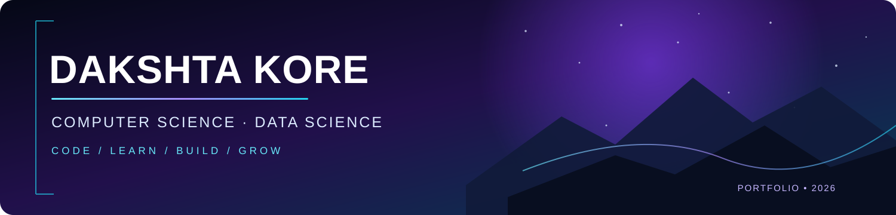

### Computer Science & Engineering (Data Science) · Student Developer

Building practical projects in software, data science, and AI — one step at a time.

---

## About

I'm a third-year B.Tech student pursuing **Computer Science & Engineering (Data Science)** at **Shri Shankaracharya Institute of Professional Management and Technology, Raipur**. I enjoy solving programming problems and building hands-on projects while developing my skills in Python, Java, data science, and AI.

- 🎓 B.Tech CSE (Data Science), third year
- 💡 Practising data structures and algorithms in C++
- 🤖 Exploring machine learning and AI through projects
- ☁️ Marketing & Design Lead, AWS Student Builder Group
- 🏀 Division-level inter-college basketball runner-up

## Skills & Tools

**Languages**

-1E293B?style=flat-square&logo=mysql&logoColor=4479A1)

**Data Science & Development**

## Featured Projects

<table>
  <tr>
    <td width="50%" valign="top">
      <h3>🏡 Airbnb Price Prediction</h3>
      A machine-learning project to estimate Airbnb listing prices, with an interactive Streamlit interface.
        
      Python · Pandas · Scikit-learn · Streamlit
    </td>
    <td width="50%" valign="top">
      <h3>🤖 Multi-Agent Workspace</h3>
      A Streamlit-based workspace exploring collaboration between AI agents using the Gemini API.
        
      Python · Streamlit · Gemini API
        
      <a href="https://github.com/Dakshta-KORE/Multi_AI_Agent">View repository →</a>
    </td>
  </tr>
  <tr>
    <td colspan="2" valign="top">
      <h3>🧹 Data Cleaning</h3>
      A project focused on data preparation and cleaning workflows.
        
      <a href="https://github.com/Dakshta-KORE/Data-cleaning">View repository →</a>
    </td>
  </tr>
</table>

## GitHub Activity

## Currently Focused On

- Improving problem-solving and DSA with C++
- Building practical Python and machine-learning projects
- Strengthening Java, SQL, and Git fundamentals
- Learning through experimentation and collaboration

---

*“Small steps every day lead to big results.”*

Thanks for visiting my profile — feel free to connect!

